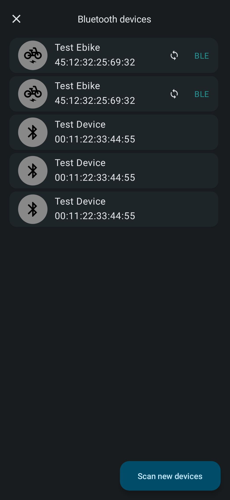
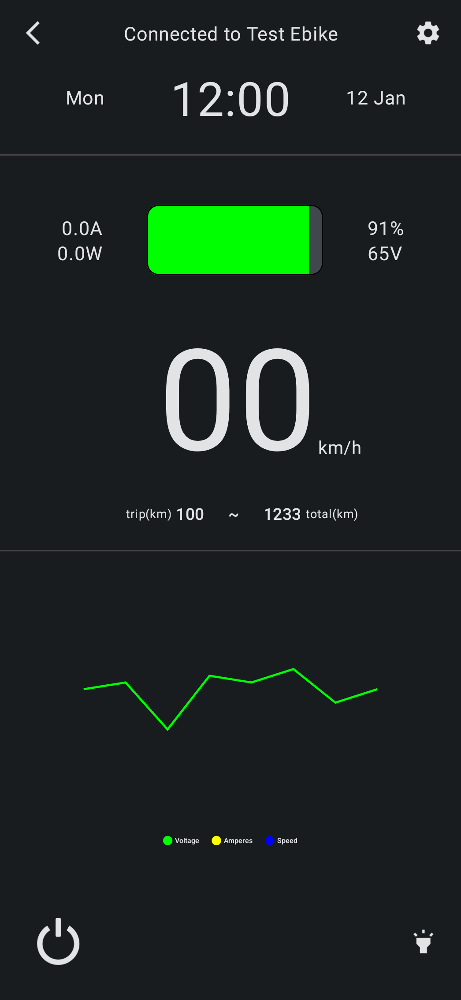

# Bluetooth bike connection

This is a simple app to connect to a ebike via bluetooth, get the data from it, and also send data to the bike.

| Devices screen                       | Bike screen                         |
|--------------------------------------|-------------------------------------|
|  |  |
|                                      | Content Cell                        |