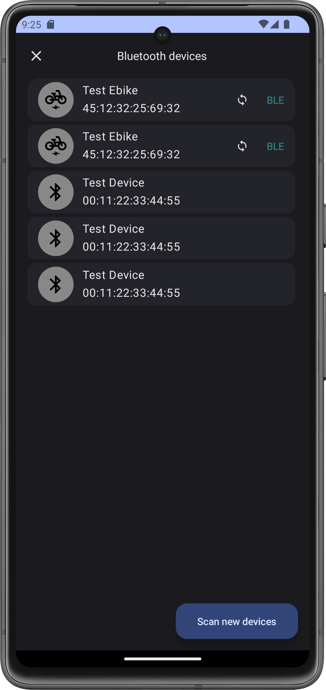
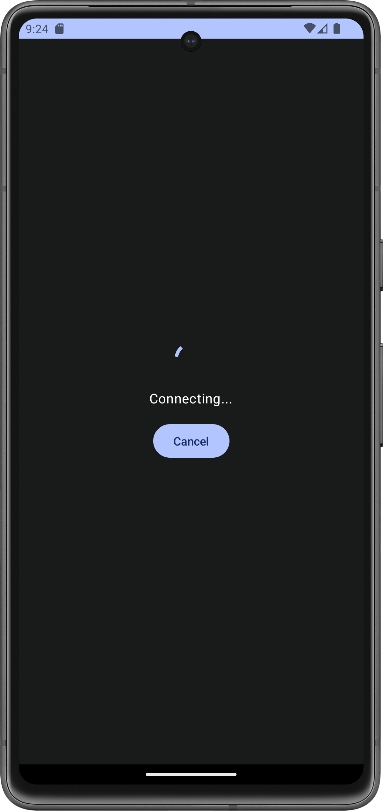
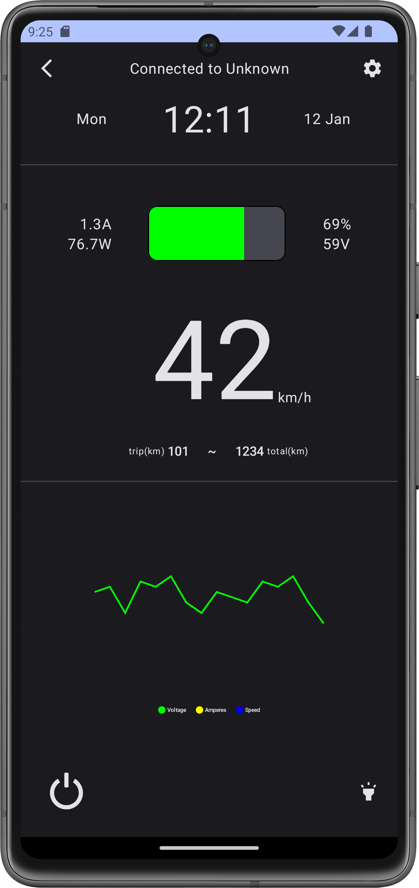

Bluetooth Ebike connector
=====

Simple app to connect to a Ebike via bluetooth, get the data from it, and send commands back to
interact with it.

|  |  |  |
|------------------------------------|-------------------------|---------------------------------|

